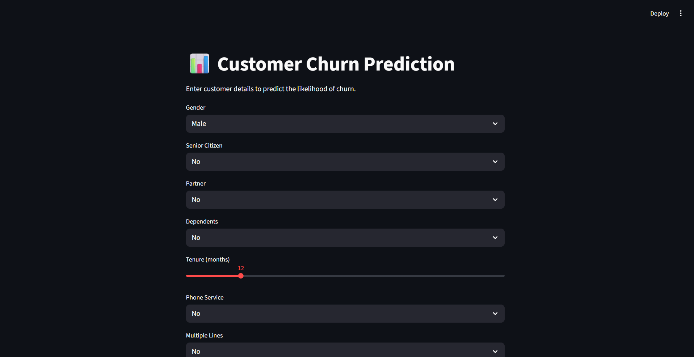
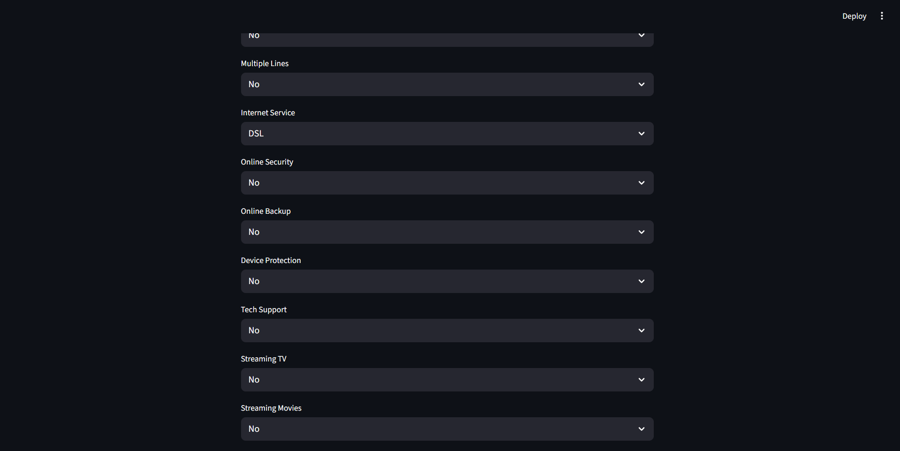
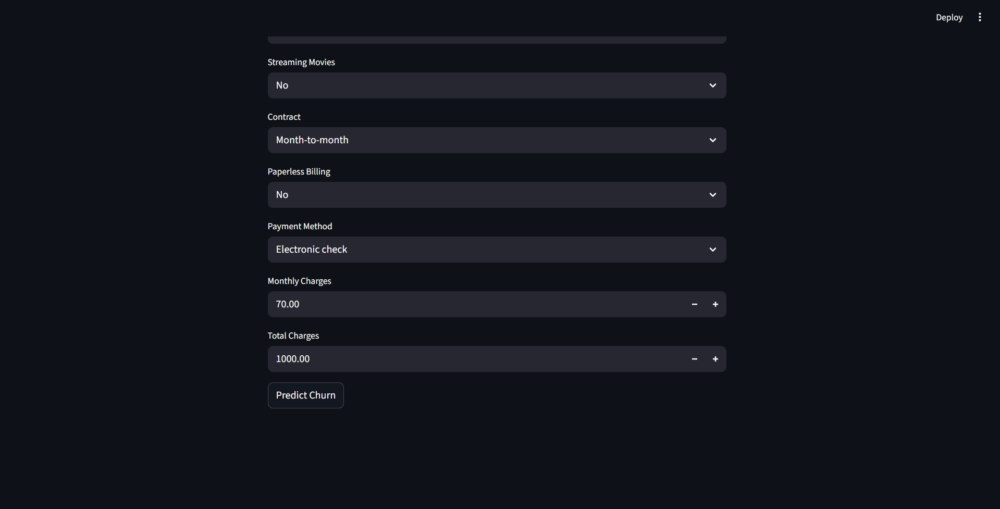

# ChurnGuard — Telco Customer Churn Prediction

A machine learning web app that predicts whether a telecom customer is likely to churn, built with **Python, scikit-learn, and Streamlit**. Enter a customer's details and get an instant churn prediction with probability score.


## Demo

**Main input form:**



**Service & billing details:**



**Prediction result:**



## Overview

Customer churn — when a customer stops using a company's service — is one of the most costly problems in subscription-based businesses. This project uses the **Telco Customer Churn dataset** to build a predictive model that flags at-risk customers before they leave, enabling proactive retention strategies.

**Key business insight:** Accuracy alone was misleading due to class imbalance (73.5% stayed vs. 26.5% churned). Logistic Regression was selected as the final model despite lower raw accuracy than Random Forest, because it recalls **78%** of true churners vs. Random Forest's 64% — and in churn prediction, missing an at-risk customer is more costly than a false alarm.

## Features

- Interactive web UI for entering customer details
- Real-time churn prediction with probability score
- Trained on 7,000+ real telecom customer records
- Handles categorical encoding and feature scaling automatically behind the scenes
- Clean, reproducible ML pipeline (EDA → Cleaning → Modeling → Deployment)

## Tech Stack

| Category | Tools |
|---|---|
| Language | Python 3.10+ |
| Data Handling | pandas, NumPy |
| Visualization | matplotlib, seaborn |
| Machine Learning | scikit-learn (Logistic Regression, Random Forest) |
| Web App | Streamlit |
| Model Persistence | joblib |

## Project Structure

```
CHURNGUARD/
│
├── data/
│   ├── WA_Fn-UseC_-Telco-Customer-Churn.csv   # Raw dataset
│   └── churn_cleaned.csv                       # Cleaned, encoded dataset
│
├── notebooks/
│   ├── EDA.ipynb                                # Exploratory Data Analysis
│   ├── Cleaning.ipynb                           # Data cleaning & preprocessing
│   └── Modeling.ipynb                           # Model training & evaluation
│
├── model/
│   ├── churn_model.pkl                          # Trained Logistic Regression model
│   ├── scaler.pkl                                # Fitted StandardScaler
│   └── model_columns.pkl                        # Column structure for inference
│
├── app.py                                        # Streamlit web application
├── requirements.txt
└── README.md
```

## Dataset

- **Source:** [Telco Customer Churn dataset](https://www.kaggle.com/datasets/blastchar/telco-customer-churn) (Kaggle)
- **Rows:** 7,043 customers
- **Columns:** 21 features (demographics, account info, services subscribed)
- **Target:** `Churn` (Yes/No)

## Model Performance

| Metric | Logistic Regression | Random Forest |
|---|---|---|
| Accuracy | 0.738 | 0.776 |
| Precision (Churn) | 0.504 | 0.569 |
| **Recall (Churn)** | **0.783** | 0.642 |
| F1 Score | 0.614 | 0.603 |

**Logistic Regression** was chosen as the production model due to its significantly higher recall on the churn class — critical for minimizing missed at-risk customers.

### Top Predictors of Churn (Feature Importance)

1. Total Charges
2. Tenure
3. Monthly Charges
4. Contract Type (Two-year contracts reduce churn risk)
5. Internet Service Type (Fiber optic customers churn more)

## Installation & Setup

1. **Clone the repository**
   ```bash
   git clone https://github.com/your-username/churnguard.git
   cd churnguard
   ```

2. **Create a virtual environment**
   ```bash
   python -m venv .venv
   ```

   Activate it:
   - Windows: `.venv\Scripts\activate`
   - macOS/Linux: `source .venv/bin/activate`

3. **Install dependencies**
   ```bash
   pip install -r requirements.txt
   ```

4. **Run the Streamlit app**
   ```bash
   streamlit run app.py
   ```

   The app will open automatically at `http://localhost:8501`

## Usage

1. Open the app in your browser
2. Fill in the customer's details (contract type, tenure, charges, services subscribed, etc.)
3. Click **Predict Churn**
4. View the prediction result and churn probability

## Reproducing the Model

If you want to retrain the model from scratch:

1. Run `notebooks/EDA.ipynb` to explore the raw dataset
2. Run `notebooks/Cleaning.ipynb` to clean and encode the data → outputs `data/churn_cleaned.csv`
3. Run `notebooks/Modeling.ipynb` to train, evaluate, and save the model → outputs files in `model/`

## Future Improvements

- [ ] Add SHAP explainability to show why a specific prediction was made
- [ ] Deploy to Streamlit Community Cloud / Render for a public live demo
- [ ] Add hyperparameter tuning (GridSearchCV) for further performance gains
- [ ] Handle class imbalance with SMOTE and compare results
- [ ] Add a batch prediction feature (upload CSV of multiple customers)

## License

This project is licensed under the MIT License — feel free to use and adapt it.

## Acknowledgements

- Dataset: [IBM Telco Customer Churn](https://www.kaggle.com/datasets/blastchar/telco-customer-churn) via Kaggle
